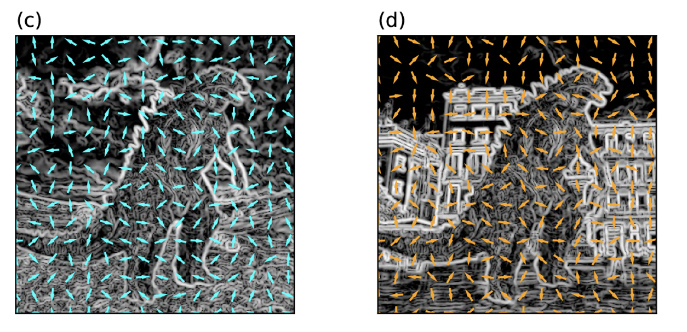

## 2024-03-22T23-44-48Z

There are `241` directories. There 15 variabels in `blacknames`, I think `blacknames` are notes? 
```python
black_names = ['4', '8', '8_b_n', '8_b_r', '16', '16_b_n', '16_b_r',
                '32', '32_b_n', '32_b_r', 'a_4', 'a_8', 'a_16', 'a_32', 'chord']
```
When I train my model using the whole dataset nothing matches. The directories are labels. 
None of the directories in the published dataset are in `blacknames`.
But there are similar labels usually named with `label_[number]` for example 
there is no `4` directory but there is 


## 2024-03-15T06-46-40Z
The traing data is either over fit, improperly labeld or something else.
The model trained with the full dataset don't work... 


```python
black_names = ['4', '8', '8_b_n', '8_b_r', '16', '16_b_n', '16_b_r',
                '32', '32_b_n', '32_b_r', 'a_4', 'a_4_075', 'a_8', 'a_16', 'a_32', 'chord']

# or
black_names = os.listdir('data/training_data/')
```

The model will work if I properly include all of the `blacknotes` labels from the 
directories. 

## 2024-03-14T02-20-01Z

There are `102` directories in the training data I have downloaded, 
There are `241` directories in the dataset posted on google drive.
That means I'm missing `139` feature labels and `57%` of the dataset.

- [Training Data](https://drive.google.com/drive/u/0/folders/1OVGA3CGnEKjyg_k_L8MP2RO5R3oDIbHE)

## 2024-03-04T05-38-27Z

my understanding of a histogram is just a "bar graph" of the frequency 
of elements in an array. For a histogram of a collored image this 
would be the counts of red, green and blue pixels in an image although
I don't know at what threashold we count a pixel value to be red, green
or blue. For this project we are not using a histogram of colored pixels,
all of our dataset is grey scale and we convert images into greyscale 
before getting predictions from the model. We can see that 
our image is the return value of `extract_hsv_histogram()` which applies
openCVs Histogram of Oriented Gradients method to it. A histogram 
of of grey scale images is mesuring the **intencity** of a pixel on
a scale from 0 to 255, rather than the color values. The "oriented"
part has something to do with the direction the intensity flows from 
one part to another pixel. I belive this has something to do with 
finding edges of pixels in images but I don't understand the math 
behind it (which involves some trig).  

These are some images that describe what I mean



As you can see the arrows on the image are pointing to where the intensity 
either increases or decreases (i don't know whih one) but the arrow would 
be where the "oriented" comes from and the direction of intencity would 
be where the "gradient" comes from. 

I belive all of this means whatever hog is doing, it relates to finding 
the edges of objects in an image. If we know the edges we can make out 
shapes?

A big question I have is, how does the model know it's being trained 
on a hog dataset rather than the other standard formats of data?


## 2024-03-03T10-24-03Z

The reson `run_experiment` is named `run_experiment` is because
it looks like the original developer was testing out multiple 
different models and "feature sets". 

These models are fetched from `load_classifiers()` as a dictionary 
of different sklean models. 

```python
    classifiers = {
        'SVM': svm.LinearSVC(random_state=random_seed),
        'KNN': KNeighborsClassifier(n_neighbors=7),
        'NN': MLPClassifier(activation='relu', 
                            hidden_layer_sizes=(200,),
                            max_iter=10000, alpha=1e-4,
                            solver='adam', verbose=20,
                            tol=1e-8, random_state=1,
                            learning_rate_init=.0001,
                            learning_rate='adaptive')
    }
```

The only one actually used in the final product was 'NN' which is a Multi Layer
Perseptron Classifier, which is an old term for Nural Network.

the second paramater taken by `run_experiment` is `feature_set='hog'`.  `HOG`
stands for Histogram of Oriented Gradients.

Before feeding the images to the model for training the dataset is loaded with
this feature_set flag set as `hog`

```python 
features, labels = load_dataset(feature_set, dir_names) 
```

`features` is actually an array of `ndarrays`, these arrays corispond to images
from the dataset. `labels` are just the name of directories corisopding to the 
images.


`load_dataset()` itterates through the dataset, converts each image to an
ndarray and passes it to `extract_features()` with the argument of the image and
a string specifiying the feature set. which is allways `hog`


`extract_hog_features` then calls `extract_hog_features` which does the
`Histogram of Oriented Gradients` thing which I don't understand.

We can simplify all this removing the dynamic parts. 
- return only a `sklearn` modle and random seadfrom `load_classifiers`
- refactor `load_dataset` to always use `hog` feature extraction

but something tells me I should at least try to use the other feature
extractors and models to see how they do.


## 2024-01-28T05-25-59Z
rotation seems to be the biggest problem

- https://www.youtube.com/@OpticalMusicRecognition
- https://drive.google.com/file/d/10E6YZPazVhFrROcea63f1j6ZtLQnyBk-/view
